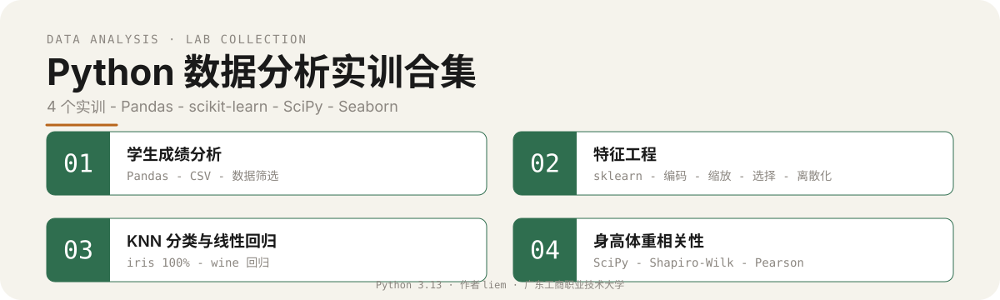
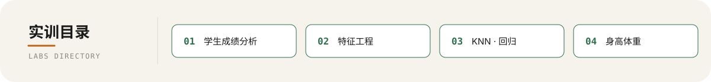

<p align="center">
  
</p>

## 实训项目一览

<p align="center">
  
</p>

| 编号 | 实训主题 | 目录 | 技术栈 | 核心方法 / 结果 |
| :--: | :-- | :-- | :-- | :-- |
| 01 | 学生成绩分析 | `lab01_student_score_analysis/` | Pandas · NumPy | 数据生成 · CSV 读写 · 条件筛选 |
| 02 | 特征工程 | `lab02_feature_engineering/` | scikit-learn | 缺失值 · 编码 · 缩放 · 特征选择 · 离散化 |
| 03 | KNN 分类与线性回归 | `lab03_ml_classification_regression/` | scikit-learn | iris KNN 准确率 100% · wine 线性回归预测酒精含量 |
| 04 | 身高体重相关性 | `lab04_height_weight_correlation/` | SciPy · Pandas · Matplotlib · Seaborn | Shapiro-Wilk 检验 · Pearson · Spearman · 可视化 |

## 这是什么

一个 Python 数据分析实训合集,由 4 个独立实验组成,覆盖数据采集、特征处理、机器学习建模与统计相关性分析的完整流程。

## 为什么不同

四个实训一次性覆盖 Python 数据分析的三大支柱:**Pandas** 数据处理、**scikit-learn** 机器学习、**SciPy** 统计推断。每个实验自带数据、脚本、可视化产物与实验报告,无需额外数据源即可直接复现。

## 工作原理

- **Lab01 学生成绩分析** — 用 Pandas / NumPy 生成学生成绩数据,写入 CSV,再读取并按科目、分数段、排名等条件筛选,演示数据采集与清洗的基础流程。
- **Lab02 特征工程** — 用 scikit-learn 对原始特征做缺失值填充、类别编码、标准化缩放、特征选择与离散化,产出可直接喂入模型的特征矩阵。
- **Lab03 KNN 分类与线性回归** — 在 iris 数据集上用 KNN 完成分类(准确率 100%),在 wine 数据集上用线性回归预测酒精含量,展示监督学习的两类典型任务。
- **Lab04 身高体重相关性** — 用 SciPy 进行 Shapiro-Wilk 正态性检验,计算 Pearson 与 Spearman 相关系数,并用 Matplotlib / Seaborn 可视化分布与相关性。

## 如何使用

### 1. 安装依赖

```bash
pip install pandas numpy scikit-learn scipy matplotlib seaborn
```

### 2. 运行实训

进入对应 lab 目录,运行其中的 `.py` 主脚本(每个目录内含脚本、数据、结果图与实验报告)。

```bash
cd lab01_student_score_analysis          # 01 学生成绩分析
cd lab02_feature_engineering             # 02 特征工程
cd lab03_ml_classification_regression    # 03 KNN 分类与线性回归
cd lab04_height_weight_correlation       # 04 身高体重相关性
```

> 建议使用 Python 3.13。

## 目录结构

```
python-data-analysis-labs/
├── lab01_student_score_analysis/
│   ├── *.py
│   ├── *.csv
│   ├── *.png
│   └── 实验报告.md
├── lab02_feature_engineering/
│   ├── *.py
│   └── 实验报告.md
├── lab03_ml_classification_regression/
│   ├── *.py
│   ├── *.png
│   └── 实验报告.md
├── lab04_height_weight_correlation/
│   ├── *.py
│   ├── *.csv
│   ├── *.png
│   └── 实验报告.md
└── README.md
```

## 作者

**liem** · 广东工商职业技术大学 · Python 3.13
